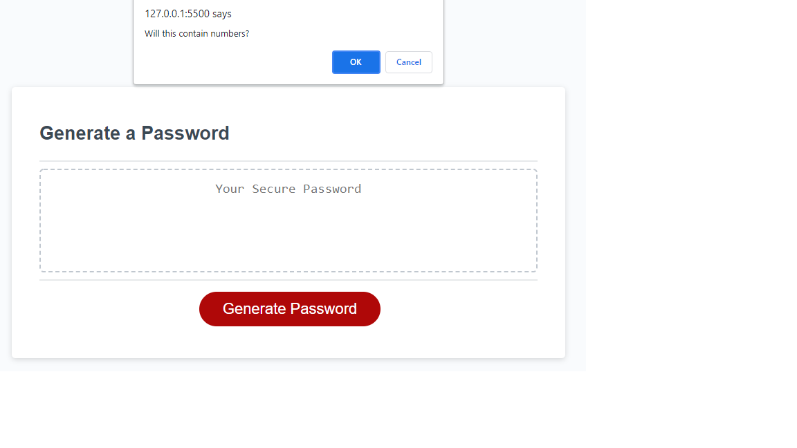
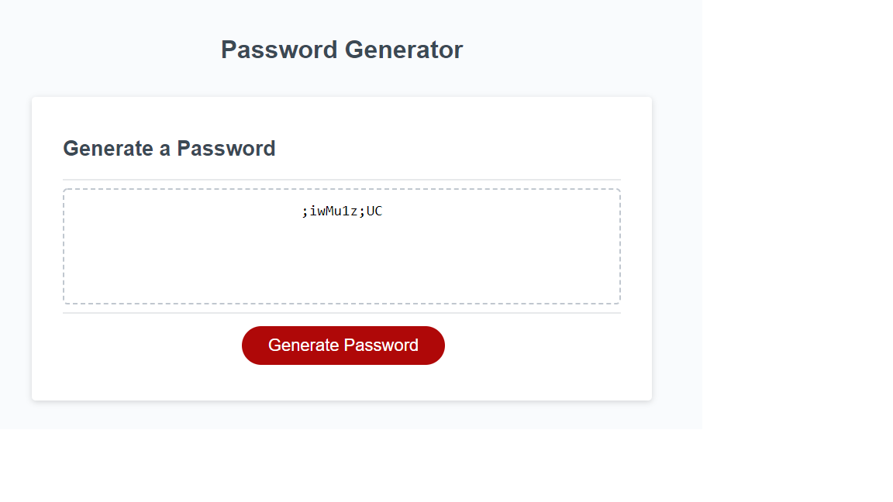

# password-generator
Javascript Challenge

**Version 1.2.0**

**Password generator challenge activity.**

The aim of this project is to create an application that an employee can use to generate a random password based on criteria they’ve selected.

This project focuses on the use of javascript to generate a random password for the user.

Other than creating a unique password, this project required the use of certain prompts to guide the user when creating a password. Using these prompts also ensured that the user selects the appropriate characters for a secure password.

## Built With

- HTML
- CSS
- Javascript

## Work Completed

**A successful completion of this project includes the following:**

- [x]Use of series of prompts
- [x]Use of loops and if, else, esleif, and while statements.
- [x]Application of arrays
- [x]Use of DOM and other methods
- [x]Creating multiple variables and functions
- [x]Applying queryselectors to retrieve information

## Project Visual

- [x]Showing the originial state of the app

- [x]Showing the state of the app with prompts

- [x]Showing the state of the app with generated password

**Github pages and links.**

This project has been deployed to GitHub Pages. 
[Deployed application](https://kenesei91.github.io/password-generator/)
[Github Repository](https://github.com/kenesei91/password-generator)

## Contributors

- Kenechukwu K Ilochonwu <keneilo91@yahoo.com>

## Licence & Copyright

© Kenechukwu K Ilochonwu, Web Project Design

Licensed under the [LICENSE] (MIT LICENSE)